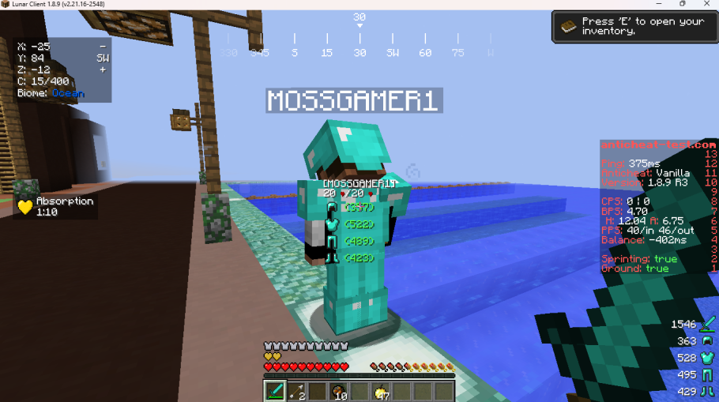

# 🌙 Lunar Agents — Mods por Java Agent para o Lunar Client

Conjunto de agentes Java que modificam o Lunar Client/Minecraft em tempo de execução — sem alterar os binários originais. Ideal para personalizar HUDs, corrigir comportamentos e habilitar recursos via hooks ASM.

<p align="center">
  <a href="LICENSE"></a>
  
  
  
</p>

> Aviso: O uso de agentes pode violar regras de servidores e/ou do próprio cliente. Use por sua conta e risco. Muitos agentes aqui oferecem vantagem em PVP (ex.: HitDelayFix, StaffEnable).

---

## ✨ Principais recursos
- 🔧 Injeção por `-javaagent` através de ASM (Bytecode) — nada de reempacotar o cliente.
- 🧩 Vários agentes focados em 1.8.9 (Lunar), incluindo correções e melhorias de HUD.
- 🛡️ Damage Indicator completo ao estilo J3, com:
  - Vida real via scoreboard (`getRealHealth`)
  - Armadura com durabilidade colorida e contagem no inventário
  - Editor in‑game para posicionamento, com persistência e teclas de atalho
- 🖥️ Compatível com Windows, Linux e macOS (exemplos priorizam Windows).

---

## 🖼️ Previews

- Damage Indicator em modo edição (exemplo ilustrativo):

<p align="center">
  
</p>

> Dica: Durante o modo edição, é exibido um placeholder mesmo sem alvo, para facilitar o posicionamento.

---

## 📦 Estrutura
```
root
├─ agents/                 # Subprojetos (um por agente)
│  ├─ DamageIndicator/
│  ├─ FixTargetCalculate/
│  ├─ HitDelayFix/
│  ├─ LunarEnable/
│  ├─ LunarPacksFix/
│  ├─ NoJumpDelay/
│  └─ ...
├─ commons/                # Utilitários compartilhados (ASM, helpers, etc.)
├─ settings.gradle         # Configuração multi-project
├─ build.gradle            # Build raiz
└─ resources/              # Mapeamentos SRG/obf
```

---

## ⚙️ Requisitos
- Java 16+ (JDK)
- Gradle Wrapper (já incluso — não precisa instalar Gradle)
- Minecraft/Lunar 1.8.9 (mapeamentos focados nesta versão)

---

## 🧱 Como compilar
- Windows:
  ```powershell
  gradlew.bat build
  ```
- Linux/macOS:
  ```bash
  ./gradlew build
  ```
Saída: `agents/<Agente>/build/<Agente>.jar`

Compilando um agente específico:
```bash
# Windows
gradlew.bat :agents:DamageIndicator:build
# Linux/macOS
./gradlew :agents:DamageIndicator:build
```

---

## 🚀 Como usar (carregar agentes)
Carregue os jars usando o parâmetro `-javaagent` da JVM:

```bash
java -javaagent:"C:\caminho\para\Agente.jar"=opcao -jar SeuLauncher.jar
```

Observações:
- Tudo após `=` é repassado como argumento ao `premain` do agente.
- Se houver espaços, use aspas. Em Windows, prefira aspas duplas externas.
- Para o launcher `lunar-client-qt`, consulte a doc do projeto para injetar parâmetros adicionais da JVM.

---

## 📚 Agentes disponíveis (resumo)

- DamageIndicator — HUD de alvo ao estilo J3 (ver seção abaixo).
- FixTargetCalculate — melhora o cálculo de `objectMouseOver` (mira/alvo).
- HitDelayFix — remove cooldown aleatório de ataque (vantagem injusta).
- LunarEnable — reabilita mods desativados (FreeLook etc.) e integrações.
- LunarPacksFix — restaura overlays de texturas do Lunar.
- NoJumpDelay — remove cooldown de pulo.

---

## 🩸 Damage Indicator (J3‑style)
HUD que mostra informações do alvo sob a mira. Implementado via hook em `GuiIngame#renderGameOverlay`.

Funcionalidades:
- Nome do alvo
- Vida real (scoreboard slot 2) com fallback para `getHealth()`
- 0–4 peças de armadura do alvo, com:
  - Ícone da peça
  - Durabilidade restante colorida (verde/amarelo/vermelho)
  - Contagem no inventário quando o alvo é o próprio jogador local

### 🔁 `getRealHealth`
- Lê o placar do servidor (`Scoreboard.getObjectiveInDisplaySlot(2)`) e retorna o valor quando `> 1`.
- Caso contrário, retorna `entity.getHealth()`.

### 🧭 Posição do indicador
Três formas de configurar (precedência de menor para maior): arquivo → variáveis de ambiente → propriedades JVM.

1) Arquivo: `~/.lunar-agents/damageindicator.properties`
```
position=center|fixed|centralizado|fixo
x=120
y=80
offsetX=0
offsetY=-25
```

2) Variáveis de ambiente:
```
DAMAGEINDICATOR_POSITION=center|fixed
DAMAGEINDICATOR_X=120
DAMAGEINDICATOR_Y=80
DAMAGEINDICATOR_OFFSET_X=0
DAMAGEINDICATOR_OFFSET_Y=-25
```

3) Propriedades JVM (recomendado):
```
-Ddamageindicator.position=center|fixed
-Ddamageindicator.x=120
-Ddamageindicator.y=80
-Ddamageindicator.offsetX=0
-Ddamageindicator.offsetY=-25
```

> Observação: as chaves `centralizado/fixo` são equivalentes a `center/fixed` internamente.

### ✏️ Modo edição (in‑game)
- F7 — entra/sai do modo edição.
- M — alterna entre `center` (offset) e `fixed` (x/y absolutos).
- Setas — movem o indicador.
- Shift — acelera (±5px).
- Ctrl — acelera mais (±20px).
- Enter — salva no arquivo de configuração e sai.
- Esc — cancela (reverte valores) e sai.

Durante o modo edição:
- Um contorno e uma caixa translúcida destacam a área do indicador.
- Dicas de teclas aparecem abaixo do indicador.
- E é exibido um crédito no canto inferior esquerdo:
  `github.com/Lopesnextgen | github.com/Adoecido`

## 🎯 FixTargetCalculate (força lógica 1.8.0)
Estabiliza a seleção de alvo e o cálculo de entidades visadas em 1.8.9 para se comportar como a 1.8.0, reduzindo "flicks" na mira e flags em anticheats (ex.: BadPacketsR/NegativeTimer).

Funcionalidades:
- Snapshot por tick de `loadedEntityList` — a lista de entidades é fotografada uma vez por tick e reutilizada ao longo do mesmo tick.
- Invalidação do snapshot no final de `World#updateEntities` — atualização controlada a cada tick (≈50 ms), não a cada chamada.
- Reescrita somente das leituras do campo `loadedEntityList` em pontos sensíveis — sem substituir métodos inteiros (comportamento não forçado).

Como usar:
```bash
# Carregar o agente (Windows)
java -javaagent:"C:\caminho\para\FixTargetCalculate.jar" -jar SeuLauncher.jar

# Opcional: ativar logs de debug
java -javaagent:"C:\caminho\para\FixTargetCalculate.jar"=debug -jar SeuLauncher.jar
```

Validação sugerida:
- Entre em um cenário com muitos players num mesmo bloco (ex.: teia) e observe a estabilidade do alvo dentro do mesmo tick.
- Com `=debug`, procure por logs como:
  - `[FixTargetCalculate] Patched World: ...`
  - `[World] snapshot refresh size=...`

Observações:
- Compatível com 1.8.9; não altera a física nem a lógica do servidor.
- Evite usar com outros agentes que substituam agressivamente métodos de `World`.

## 🦘 NoJumpDelay
Remove o tempo de recarga de pulo no cliente, permitindo saltos em ticks consecutivos (mais responsivo para parkour/PvP). Pode ser considerado vantagem injusta por servidores.

Como usar:
```bash
# Carregar o agente (Windows)
java -javaagent:"C:\caminho\para\NoJumpDelay.jar" -jar SeuLauncher.jar
```

Detalhes:
- Implementado via hook ASM no cliente para zerar/ignorar o cooldown de pulo.
- Não modifica o servidor; se o servidor aplicar verificações server‑side, o efeito pode ser limitado.
- Use por sua conta e risco (passível de flag em alguns anticheats).

---

## 🧩 Compatibilidade e limitações
- Foco em 1.8.9 — pode falhar em outras versões.
- Mudanças no cliente/launcher podem quebrar os hooks a qualquer momento.
- Evite carregar múltiplos agentes que transformam o mesmo método de forma incompatível.

---

## 🛠️ Solução de problemas
- JVM não inicia com `-javaagent`:
  - Verifique caminho do jar e permissões.
  - Use Java 16+.
- "Não faz efeito":
  - Confirme a versão (1.8.9).
  - Confirme que o agente está realmente sendo carregado.
  - Revise a sintaxe: `-javaagent:"...jar"=valor`.

---

## 🤝 Contribuindo
- PRs são bem-vindos. Mantenha cada agente isolado ao máximo.
- Para um novo agente: crie `agents/<Nome>` + `gradle.properties` com `agentClass=<pacote>.Agent`.
- Siga o padrão `premain(String, Instrumentation)` e empacotamento com ShadowJar.

---

## 🧾 Licença
GPLv3 — veja [`LICENSE`](LICENSE).

---

## 🙌 Créditos
- github.com/Lopesnextgen
- github.com/Adoecido